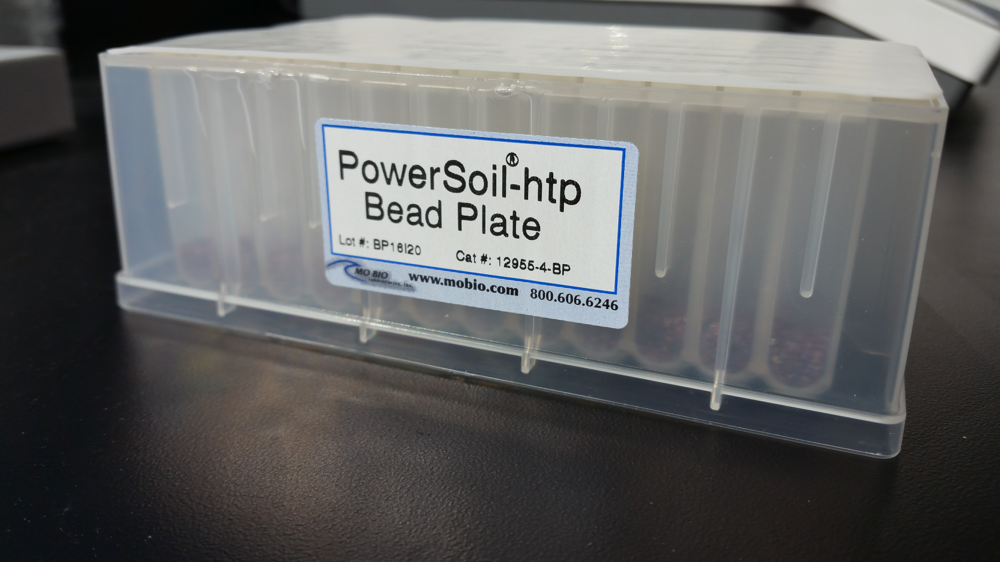
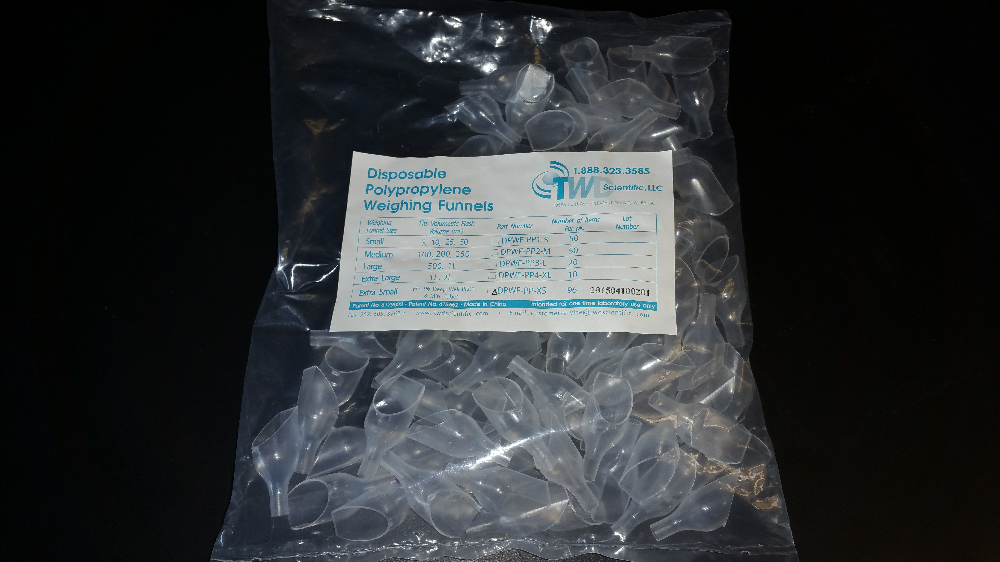

Data sheets: https://github.com/jflater/SOPs/tree/master/DNA_sub_sampling/datasheets
Author:  Jared Flater
email: jflater@gmail.com
Date:  10/27/16

#Purpose

  We are looking into the bacterial community composition of soil, an important component of ecological systems. We will target the bacterial marker gene (16S r RNA) within the environmental DNA sample that we will extract with PowerSoil kits (Mo Bio). Because of the slow rates of evolution of this region of the gene, we can use them to reconstruct a phylogeny of our samples.  

#PPE
  1. Gloves
  2. Eye protection
  3. Lab coat

#Materials

  01. Soil samples
  02. Micro-balance
  03. 70% ethanol
  04. Funnels
  05. Weigh boats and or weigh paper
  06. Spatulas
  07. Alcohol flame
  08. Data sheet
  09. 96 well Bead Plate
  10. Whirl packs for chemical analyses sub sampling
  11. Sharpies
  
#Procedure:
First: Ethanol and prepare work station

  01. Remove soil samples from -80 freezer, location: 4th floor -80, 3rd freezer on the south side, 3rd shelf.
    note: to preserve samples as best as possible, remove only 1 group at a time. 
  02. Layout samples on the bench to match the order that the samples are in on the datasheet.
  03. Label a corresponding whirl pack for chemical sub sampling for each sample. 
  03. Sterilize gloves/hands with 70% ethanol.
  04. Sterilize spatulas by making sure they are clean and then flaming them. 
  05. Using sterile spatula and weigh paper, sub sample 0.23 g to 0.25 g of soil into weigh boat or weigh paper.
  06. Record mass of soil on datasheet, confirm that it is the correct sample.
  07. Place fresh funnel in target well and slowly transfer soil from weigh boat into funnel and well.
  08. Repeat two more time for three technical replicates.
  09. Sub sample 50 g into whirl pack for chemical analyses
  10. Grab or clean your spatula and get a new weigh boat and repeat steps 5-6 for the remaining samples in     the set.
  11. Repeat step 3.
  12. Repeat steps 4-9 for all sets of samples
  13. Return samples, bead plate (wrapped in foil) and the sub sample whirl packs to the -80 in the original location.
  14. When complete, email Jared
  
#Clean up:
  
  01. Spatulas and funnels should be soapy water brushed and ethanoled. Allow to dry and return to sub sampling      kit in the GERMSLAB
  
  
### CAUTION - BEFORE YOU ORDER BE SURE TO ASK IF YOU ARE USING THE ROBOT OR MANUAL EXTRACTION BECAUSE THEY ARE DIFERENT KITS ###

