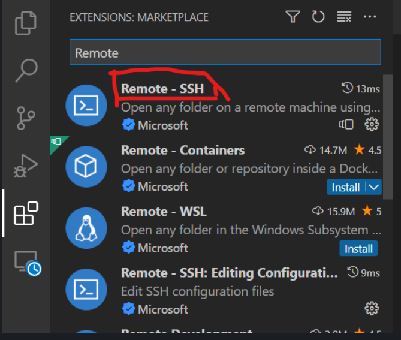
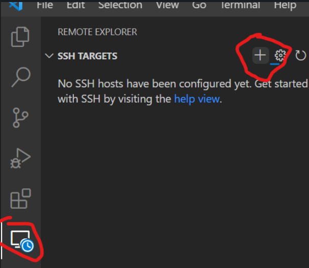
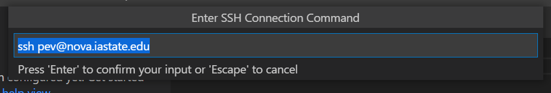
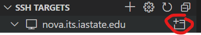
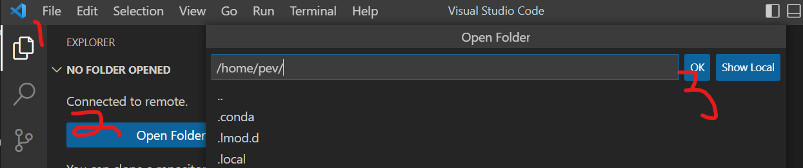
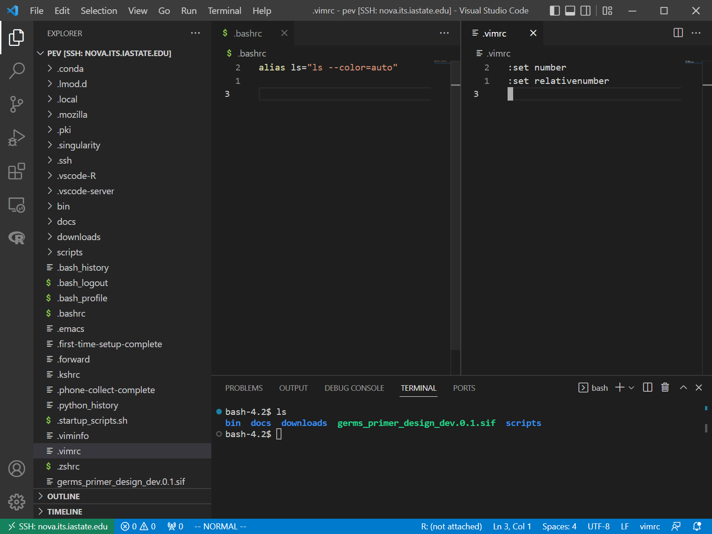
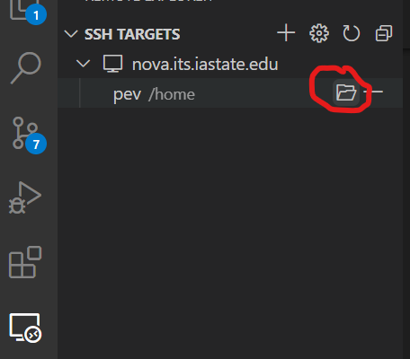

# Setting up Visual Studio Code for Nova

I highly recommend using [VSCode](https://code.visualstudio.com/) for at least Nova. I use it for everything besides R (where I still use RStudio). 
With a few minutes set up, VSCode will simplify connecting to Nova, allow you to open multiple shells, have a GUI file navigation system, drag and drop files between your local machine and the remote, and let you open documents in a code window (separate from the shell). 

## Setting it up

Here are the basics to set it up:

1. Download and install [VSCode](https://code.visualstudio.com/)
1. Open it up and click on the extensions button on the left hand side. Search for the Remote -SSH extension in the toolbar that pops up and install it 

1. After installing it, a new icon should appear underneath it for the Remote Explorer - click on it, then click on the + sign to open a new connection (second picture)

1. A series of prompts will show up in the middle of the page:

    * Connect to Nova the usual way with `ssh <isu-netid>@nova.its.iastate.edu`
    * When it asks you for which SSH configuration file to update, click the first one, which should be something along the lines of `~/.ssh/config`
1. You'll see `nova.iastate.edu` appear under `SSH Targets`; hover over it and select the "Connect to Host in New window" button: 

1. A new VS Code window will pop up.
    * Select `Linux` as your operating system
    * Enter your Google Authenticator code
    * Enter your password
1. Once you successfully log in (and potentially after some initial setup), you should see a blank VS Code window. We're now going to add our home directory so we can see it in the file navigation system. 
    1. Click on the file icon in the upper left. 
    1. Click on "Open Folder"
    1. A prompt will open up asking which folder you would like to open. You can put whatever path on the system you'd like (for example, `/work/adina` is another useful location), but for now, we'll use the default `/home/<isu-id>`. Click OK

    1. The window will restart and you'll be asked to reauthenticate
1. Once you successfully authenticate, you should see the contents of your home directory on the left hande side after clicking on the file icon. 

That's pretty much it! 

## Opening up shell windows

If you don't see a command prompt, open one with `` CTRL + /` `` (Control + backtick, usually above the left tab), or go to `View > Terminal`. 

You can open up multiple shell windows in a couple ways:

* Pressing the `+` button opens up an additional shell. You can switch between your sessions by clicking on their names to the right.
* Pressing the split pane button that looks like `[|]` will split the pane with two shell prompts.

## Opening files

You can open up files for text editing by:

* Double clicking them
* Dragging them to the pane on the right.
* Typing `code <filename>` on the command line. This is particularly useful for files not in your Explorer. 
    * Note that once you install VSCode on your machine, you can do this on your local command line. It's particularly useful for opening up a repo from the command line: `code path/to/repo`. This will open up the entire repository in a new VSCode window with all the files in the explorer.

You can also drag multiple files to the side of the pane on the right open multiple files for editing. 

You're also able to open up any file you'd like from the prompt by typing `code <file name>`. If the file doesn't exist, VSCode will craete this file for you.

## Downloading files to your local machine

If you see the file in your explorer window, you can `right click > Download` to save it to your local. If it's not there, I believe you have to do the standard `scp <netid>@nova.its.iastate.edu:<file_name> /where/to/put` from your local machine.

## Connecting back to Nova

By default, Visual Studio Code will reopen the last window you had open. This means that if you had Nova open last, it'll automatically try to reconnect you. If this isn't the case, click on the remote explorer icon, then click on icon to the right of your home directory to reconnect:

You'll be prompted for your authentication stuff again.

## Next steps

That's it! You're ready to go! There's a ton more to VSCode, though, and I recommend you explore the extensions you can download and the huge customization options available.